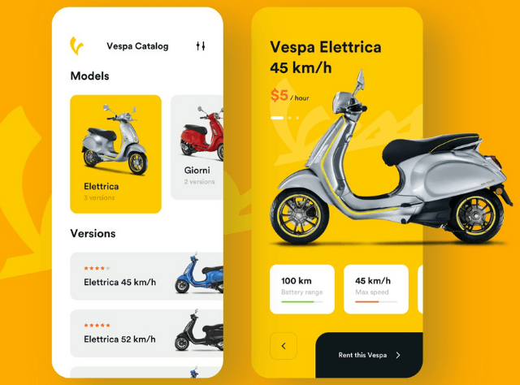

# Car and Bike Rental Mobile App

## Overview

This is a mobile application developed for Android that allows users to rent cars and bikes. The app is built using Java and Kotlin, leveraging Android's modern development tools and libraries. It provides a seamless user experience for browsing available vehicles, booking rentals, and managing rental details.



## Features

- **User Authentication**: Sign up, log in, and manage user profiles.
- **Vehicle Listings**: Browse available cars and bikes with details and photos.
- **Booking System**: Reserve and manage vehicle rentals with real-time availability updates.
- **Payment Integration**: Secure payment processing for rentals.
- **Booking History**: View and manage past and upcoming bookings.
- **Notifications**: Receive updates and reminders about bookings and promotions.
- **Admin Panel**: Manage vehicle inventory, user accounts, and bookings.

## Technologies Used

- **Languages**: Java, Kotlin
- **Android SDK**: Latest version for Android development
- **Libraries**:
  - Retrofit for API calls
  - Room for local database management
  - Glide for image loading
  - Firebase for authentication, real-time database, and storage
  - Kotlin Coroutines for asynchronous programming
  - ViewModel and LiveData for managing UI-related data
  - Android Navigation Architecture for navigation between app screens
  - Kodein for dependency injection
  - Material Design components for UI
- **Architecture**:
  - MVVM (Model-View-ViewModel) architecture
  - LiveData for data binding and updates

## Setup

### Prerequisites

- Android Studio (latest version)
- Android SDK
- Gradle

### Installation

1. **Clone the Repository**:
   ```bash
   git clone https://github.com/LikithViswanath/TurboRentals/tree/main
   ```

2. **Open the Project**: Open Android Studio and select Open an Existing Project. Navigate to the cloned repository and open it.

3. **Sync Gradle**: Once the project is opened, Android Studio will prompt you to sync Gradle. Click on Sync Now to download the necessary dependencies.

4. **Set Up Firebase**: Create a Firebase project in the Firebase Console.
Follow the setup instructions to add Firebase to your Android project. Download the google-services.json file and place it in the app directory of your project.
Enable Authentication, Firestore, and any other Firebase services used by the app.
Run the Application: Connect an Android device or start an emulator. Click the Run button in Android Studio to build and run the application.

### Configuration

1. **Firebase Settings**: Ensure Firebase settings are configured properly in the google-services.json file.

2. **Sign Up / Log In**: Open the app and sign up or log in using your credentials.

3. **Browse Vehicles / Add Vehicles**: Navigate to the vehicles section to view available cars and bikes or add new cars and bikes.

4. **Book a Vehicle**: Select a vehicle, choose the rental period, and proceed with booking.

5. **Manage Bookings**: Access your booking history to view or manage past and upcoming rentals.

6. **Admin Panel**: Admin users can access the admin panel to manage inventory and bookings.

